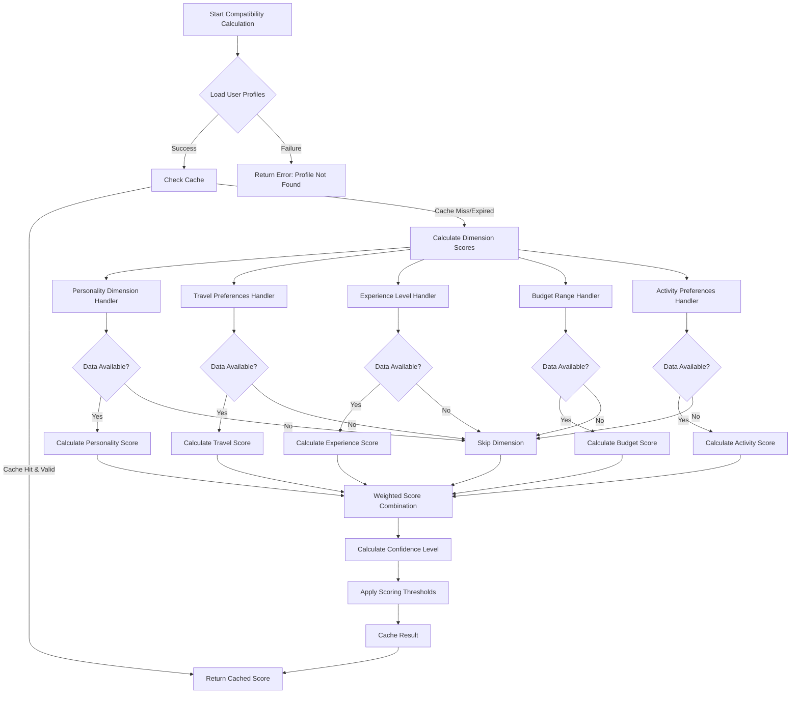

# Compatibility Scoring Algorithm - Architecture Specification

## Overview

The compatibility scoring system is designed to match users based on multiple dimensions of compatibility, creating optimal group compositions for travel adventures. The system uses a weighted scoring algorithm with configurable parameters and intelligent caching.

## Architecture Components

### 1. Core Algorithm Architecture

```
┌─────────────────────────────────────────────────────────────┐
│                 Compatibility Scoring Engine                 │
├─────────────────────────────────────────────────────────────┤
│  ┌───────────────┐  ┌───────────────┐  ┌─────────────────┐  │
│  │   Dimension   │  │   Dimension   │  │    Dimension    │  │
│  │   Handler 1   │  │   Handler 2   │  │    Handler N    │  │
│  └───────────────┘  └───────────────┘  └─────────────────┘  │
│           │                  │                    │         │
│  ┌─────────────────────────────────────────────────────────┐  │
│  │            Weighted Scoring Formula              │  │
│  └─────────────────────────────────────────────────────────┘  │
│           │                                                 │
│  ┌─────────────────────────────────────────────────────────┐  │
│  │               Caching Layer                       │  │
│  └─────────────────────────────────────────────────────────┘  │
└─────────────────────────────────────────────────────────────┘
           │
┌─────────────────────────────────────────────────────────────┐
│                    Database Layer                           │
│  ┌───────────────────┐  ┌───────────────────────────────────┐ │
│  │ User Profiles &   │  │    Compatibility Scores Cache    │ │
│  │   Assessments     │  │         & Algorithm Config      │ │
│  └───────────────────┘  └───────────────────────────────────┘ │
└─────────────────────────────────────────────────────────────┘
```

### 2. Scoring Dimensions

The algorithm evaluates compatibility across 5 key dimensions:

#### A. Personality Traits (Weight: 35%)
- **Energy Level**: Activity intensity preference (0-100)
- **Social Preference**: Group vs solo preference (0-100)
- **Adventure Style**: Openness to new experiences (0-100)
- **Risk Tolerance**: Willingness to try challenging activities (0-100)

**Calculation Method**: Similarity-based scoring using normalized trait differences
```typescript
similarity = 1 - (|trait1 - trait2| / 100)
dimensionScore = weightedAverage(similarity_scores) * 100
```

#### B. Travel Preferences (Weight: 25%)
- **Adventure Style**: thrill_seeker, explorer, relaxer, cultural, social
- **Budget Preference**: budget, moderate, luxury, flexible
- **Planning Style**: spontaneous, flexible, structured, detailed
- **Group Preference**: solo, couple, small_group, large_group

**Calculation Method**: Categorical matching with compatibility matrices
```typescript
// Exact matches get full score, adjacent categories get partial score
budgetCompatibility = {
  exact_match: 1.0,
  adjacent: 0.7,
  distant: 0.3
}
```

#### C. Experience Level (Weight: 15%)
- **Overall Experience**: 1-5 scale across adventure activities
- **Category-Specific**: Experience in specific activity types

**Calculation Method**: Tolerance-adjusted similarity scoring
```typescript
experienceScore = calculateSimilarity(exp1, exp2, tolerance) * adjustmentFactor
```

#### D. Budget Range (Weight: 15%)
- **Range Overlap**: Intersection of budget ranges
- **Flexibility Factor**: How flexible users are with budget

**Calculation Method**: Range overlap calculation with flexibility adjustments
```typescript
overlapScore = overlapSize / averageRangeSize
adjustedScore = overlapScore + (flexibility * flexibilityFactor * (1 - overlapScore))
```

#### E. Activity Preferences (Weight: 10%)
- **Preferred Activities**: Activities users enjoy
- **Must-Have Activities**: Non-negotiable activities
- **Deal Breakers**: Activities that are absolute no-gos

**Calculation Method**: Set intersection analysis with conflict detection
```typescript
if (hasConflicts(activities1, activities2)) return 0;
score = (preferredOverlap * 0.7) + (mustHaveOverlap * 0.3)
```

### 3. Algorithm Decision Tree



### 4. Scoring Thresholds and Categories

#### Compatibility Score Ranges
- **Excellent Match (80-100)**
  - Strong compatibility across all dimensions
  - Minimal conflict potential
  - High group dynamics contribution
  - Color: #10B981 (Green)

- **Good Match (60-79)**
  - Solid compatibility with minor differences
  - Manageable conflict potential
  - Positive group dynamics contribution
  - Color: #3B82F6 (Blue)

- **Fair Match (40-59)**
  - Moderate compatibility requiring communication
  - Some conflict potential requiring management
  - Neutral group dynamics impact
  - Color: #F59E0B (Yellow)

- **Poor Match (0-39)**
  - Low compatibility across multiple dimensions
  - High conflict potential
  - Negative group dynamics impact
  - Color: #EF4444 (Red)

#### Confidence Level Calculation
Confidence is calculated based on:
- **Data Completeness**: How much profile data is available (0-100%)
- **Calculation Success**: Which dimensions were successfully calculated
- **Recency**: How recent the profile data is

```typescript
confidence = (profileCompleteness * calculationSuccess) * recencyFactor
```

### 5. Caching Strategy

#### Cache Configuration
- **TTL (Time To Live)**: 24 hours for stable scores
- **Max Size**: 10,000 cached entries
- **Compression**: Enabled for storage efficiency
- **Warmup Strategy**: Lazy loading on first request

#### Cache Invalidation Rules
- **Profile Updates**: Clear user-specific cache entries
- **Group Changes**: Clear group-specific cache entries
- **Algorithm Updates**: Clear all cache entries
- **Manual**: Admin-triggered cache clearing

#### Cache Key Structure
```typescript
// Individual pair: "user1Id-user2Id" (sorted)
// Group-specific: "user1Id-user2Id-groupId"
```

### 6. Performance Optimizations

#### Calculation Optimizations
- **Parallel Processing**: Dimension calculations run concurrently
- **Memoization**: Cache intermediate calculations within request
- **Batch Processing**: Bulk calculations use Promise.all
- **Lazy Loading**: Load dimension handlers only when needed

#### Database Optimizations
- **Connection Pooling**: Reuse database connections
- **Query Optimization**: Use indexed columns for lookups
- **Bulk Inserts**: Batch cache persistence operations

### 7. Group Dynamics Analysis

For group compatibility analysis, additional metrics are calculated:

#### Group Cohesion Score
```typescript
cohesion = averageCompatibilityScore
```

#### Diversity Score
```typescript
diversity = standardDeviation * diversityFactor
// Some variance is healthy, too much creates conflict
```

#### Leadership Distribution
```typescript
leadership = calculateLeadershipDistribution(personalityProfiles)
// Based on energy + social preference scores
```

#### Energy Balance
```typescript
energy = averageEnergyLevel(profiles)
// Group energy level balance
```

### 8. API Response Format

#### Individual Compatibility Score
```json
{
  "success": true,
  "data": {
    "user1Id": "uuid",
    "user2Id": "uuid",
    "groupId": "uuid",
    "overallScore": 78.5,
    "dimensions": {
      "personality_traits": {
        "name": "Personality Compatibility",
        "score": 82.3,
        "weight": 0.35,
        "metadata": {
          "breakdown": {
            "energyLevel": 85.0,
            "socialPreference": 79.2,
            "adventureStyle": 88.1,
            "riskTolerance": 77.0
          }
        }
      }
      // ... other dimensions
    },
    "confidence": 0.87,
    "algorithmVersion": "default-v1",
    "calculatedAt": "2025-09-14T14:30:00Z"
  },
  "explanation": "Excellent compatibility! You share similar values...",
  "meta": {
    "calculationTime": 245,
    "cacheHit": false,
    "algorithmVersion": "default-v1"
  }
}
```

### 9. Error Handling

#### Error Categories
- **PROFILE_NOT_FOUND**: Missing user profile data
- **CALCULATION_ERROR**: Error during score calculation
- **CACHE_ERROR**: Cache operation failure
- **INVALID_REQUEST**: Invalid request parameters
- **RATE_LIMIT_EXCEEDED**: Too many requests

#### Fallback Strategies
- **Partial Calculations**: Continue with available dimensions
- **Default Values**: Use neutral scores for missing data
- **Graceful Degradation**: Return lower confidence scores

### 10. Monitoring and Analytics

#### Key Metrics
- **Calculation Performance**: Average calculation time
- **Cache Hit Rate**: Percentage of cache hits vs misses
- **Algorithm Accuracy**: User feedback on match quality
- **Error Rates**: Failed calculation percentages

#### Alerts
- **High Error Rate**: > 5% calculation failures
- **Poor Performance**: > 2 second average calculation time
- **Low Cache Hit Rate**: < 70% cache efficiency
- **Memory Usage**: Cache size approaching limits

## Implementation Notes

### Security Considerations
- **Data Privacy**: Personal compatibility data is sensitive
- **Rate Limiting**: Prevent abuse of calculation endpoints
- **Authentication**: Ensure proper user authorization
- **Audit Logging**: Track compatibility calculation requests

### Scalability Considerations
- **Horizontal Scaling**: Stateless design enables load balancing
- **Database Sharding**: Partition by user ID for large datasets
- **CDN Caching**: Cache common algorithm configurations
- **Queue Processing**: Async bulk calculations for large groups

### Future Enhancements
- **Machine Learning**: Learn from successful group outcomes
- **Seasonal Adjustments**: Account for seasonal activity preferences
- **Location-Based Factors**: Consider geographical compatibility
- **Real-Time Updates**: WebSocket-based live compatibility updates

This specification provides the complete architecture for the compatibility scoring system, enabling accurate and efficient user matching for group travel experiences.